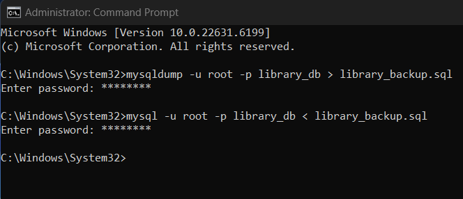

DATABASE PROJECT - Library System

Системийн тайлбар

Энэхүү төсөл нь Library System системийн өгөгдлийн санг зохион байгуулсан болно. 

Систем нь дараах үндсэн хүснэгтүүдээс бүрдэнэ:

* Table 1: Гишүүн (members)
* Table 2: Ном (books)
* Table 3: Ном түрээслэлт (borrow_records)
* Table 4: Номын санч (librarians) 

Эдгээр хүснэгтүүд нь хоорондоо Foreign Key холбоотой бөгөөд бодит системийн өгөдлийг хадгалах зориулалттай.

Ашиглах заавар (Run Instructions)

Дараах дарааллаар ажиллуулна:
1. MySQL server ажиллаж байгаа эсэхийг шалгана
2. mysqlScript.sql файлыг нээнэ
3. Бүх кодыг нэг дор ажиллуулна

Үүний үр дүнд:
* Database үүснэ
* Хүснэгтүүд үүснэ
* Өгөгдөл орно
* Query-үүд ажиллана

Файлын бүтэц

/project
mysqlScript.sql
README.md
SQL Script тайлбар

mysqlScript.sql файл нь дараах хэсгүүдээс бүрдэнэ:
* Database үүсэх
* Хүснэгтүүд (РК, FK)
* Sample data (INSERT)
* Query-үүд (JOIN, GROUP BY, HAVING)

Query бүр дээр тайлбар comment бичсэн.

4-р хэсэг: Онол (Security)

1. Primary Key ба Foreign Key ялгаа

Primary Key

Хүснэгтийн мөр бүрийг давтагдахгүй тодорхойлдог түлхүүр.
NULL байж болохгүй.
Нэг хүснэгтэд зөвхөн нэг PK байна.

Foreign Key

Нэг хүснэгтийн PK-г өөр хүснэгттэй холбодог түлхүүр.
Өгөгдлийн relationship үүсгэдэг.

Жишээ:

members.member_id → borrow_records.member_id

Ингэснээр:

Зөв гишүүнтэй холбоотой бичлэг хадгалагдана
Өгөгдлийн integrity хадгалагдана
2. COUNT ба GROUP BY яагаад хамт ашигладаг вэ

GROUP BY
Өгөгдлийг бүлэглэнэ.

COUNT
Бүлэг бүрийн мөрийн тоог гаргана.

Жишээ:

SELECT book_id, COUNT(*)
FROM borrow_records
GROUP BY book_id;

Энэ query:

Ном бүр хэдэн удаа түрээслэгдсэнийг тоолно.
3. Backup яагаад чухал вэ

Backup нь өгөгдлийн сангийн хуулбар юм.

Дараах үед хэрэгтэй:

сервер эвдрэх
өгөгдөл санамсаргүй устах
hacker халдлага
системийн алдаа

Backup байвал restore хийж өгөгдлийг сэргээж болно.

5-р хэсэг: Хэрэглэгч ба эрх (User & Privileges)

CREATE USER 'admin_user'@'localhost'
IDENTIFIED BY 'admin123';

GRANT ALL PRIVILEGES 
ON library_db.* 
TO 'admin_user'@'localhost';

CREATE USER 'report_user'@'localhost'
IDENTIFIED BY 'report123';

GRANT SELECT
ON library_db.*
TO 'report_user'@'localhost';

SHOW GRANTS FOR 'admin_user'@'localhost';

SHOW GRANTS FOR 'report_user'@'localhost';

6-р хэсэг: Backup & Restore

Ажилласан нотолгоо (MySQL CLI)

Доорх нь MySQL Command Line дээр ажиллуулсан үр дүн:

proof
Screenshot дээр:

DB name
table
result
бүгд харагдах ёстой

Оюутны мэдээлэл

* Нэр: У. Анхбаяр
* Код: B232270047

GitHub Repository

Repository link: [Энд GitHub link oруулна]
